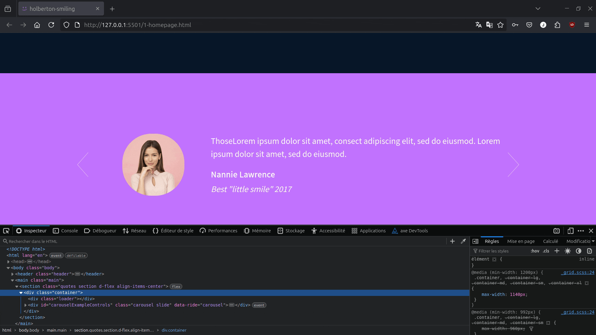

# 
Holberton Smiling School Javascript

## Learning Objectives

For this project You will use all HTML/CSS/Accessibility/Responsive design/Bootstrap/Javascript knowledges that you learned previously.

You won’t have a lot of instruction, you are free to implement it the way that you want - the objective is simple: Have fully functional web pages that look the same as the designer file.

See the final result below [Homepage](#homepage):

## Requirements

- You have to use Bootstrap
- Your `styles.css` must be as small as you can - you must - use as much as you can **Bootstrap classes**
- You have to use JQuery
- Your `scripts.js` must contain all your Javascript part
- Your Javascript must be executed only when the document - is loaded

## Mandatory Tasks

  
### 0. Fork me if you can

### 1. Homepage - quotes

### 2. Homepage - popular tutorials

### 3. Homepage - latest videos

### 4. Pricing - quotes

### 5. Courses

These group of web pages were coded from scratch with the help of the Boostrap Framework and based on some design models given on Figma.

[Figma Homepage](https://www.figma.com/file/QYQqMYbdpAHL5xTclwJKSI/Homepage)

[Figma Pricing](https://www.figma.com/file/KLAI53jdYpfFNEy0O79ymB/Pricing)

[Figma Courses](https://www.figma.com/file/ivg3abH1HLmMayBgjGg1Qf/Courses)

The designs were planned for Desktop, Tablet, and Mobile.

# Homepage

| **Desktop (Width: 1440 px)**                              | **Tablet (Width: 768 px)**                              | **Mobile (Width: 576 px)**                              |
| --------------------------------------------------------- | ------------------------------------------------------- | ------------------------------------------------------- |
|  |  |  |

# Pricing

| **Desktop (Width: 1440 px)**                             | **Tablet (Width: 768 px)**                             | **Mobile (Width: 576 px)**                             |
| -------------------------------------------------------- | ------------------------------------------------------ | ------------------------------------------------------ |
|  |  |  |

# Courses

| **Desktop (Width: 1440 px)**                             | **Tablet (Width: 768 px)**                             | **Mobile (Width: 576 px)**                             |
| -------------------------------------------------------- | ------------------------------------------------------ | ------------------------------------------------------ |
|  |  |  |

# Sections

The Holberton Smiling School web pages were developed by sections using the Bootstrap Front-End framework and CSS styles.

## CSS File

[Styles](https://github.com/jzamora5/holberton-smiling-school/blob/master/styles.css)

## Homepage

[Homepage Header/Hero Section](https://github.com/jzamora5/holberton-smiling-school/blob/master/0-homepage.html)

[Carousel of quotes](https://github.com/jzamora5/holberton-smiling-school/blob/master/1-homepage.html)

[Popular Videos](https://github.com/jzamora5/holberton-smiling-school/blob/master/2-homepage.html)

[Row of smiles](https://github.com/jzamora5/holberton-smiling-school/blob/master/3-homepage.html)

[Latest Videos](https://github.com/jzamora5/holberton-smiling-school/blob/master/4-homepage.html)

[Footer](https://github.com/jzamora5/holberton-smiling-school/blob/master/homepage.html)

## Pricing

[Pricing Header](https://github.com/jzamora5/holberton-smiling-school/blob/master/0-pricing.html)

[Prices Grid](https://github.com/jzamora5/holberton-smiling-school/blob/master/1-pricing.html)

[Quotes Section](https://github.com/jzamora5/holberton-smiling-school/blob/master/2-pricing.html)

[FAQ](https://github.com/jzamora5/holberton-smiling-school/blob/master/3-pricing.html)

[Footer](https://github.com/jzamora5/holberton-smiling-school/blob/master/pricing.html)

## Courses

[Courses Header](https://github.com/jzamora5/holberton-smiling-school/blob/master/0-courses.html)

[Search Filters](https://github.com/jzamora5/holberton-smiling-school/blob/master/1-courses.html)

[List of Results](https://github.com/jzamora5/holberton-smiling-school/blob/master/2-courses.html)

[Footer](https://github.com/jzamora5/holberton-smiling-school/blob/master/courses.html)

# Author

Jhoan Zamora: [jzamora5](https://github.com/jzamora5)  
Julie Dedieu: [Julieed-971](https://github.com/Julieed-971/)
